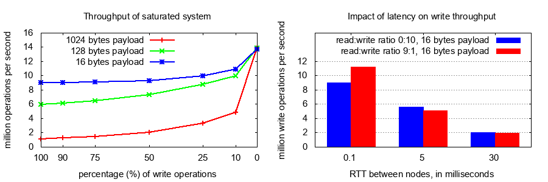
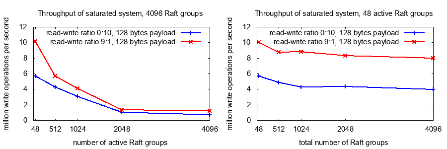
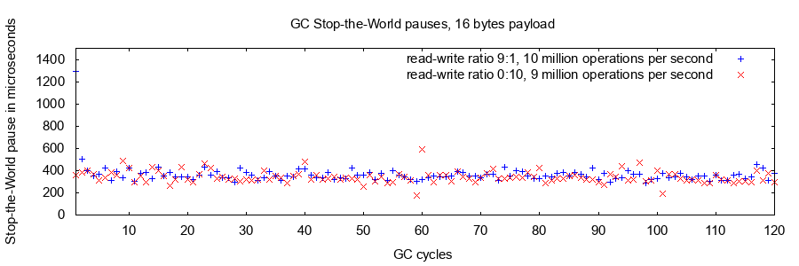

# Dragonboat - Go多组Raft库 #
[](https://github.com/lni/dragonboat/blob/master/LICENSE)

[](https://goreportcard.com/report/github.com/lni/dragonboat)
[](https://codecov.io/gh/lni/dragonboat)
[](https://godoc.org/github.com/lni/dragonboat)
[](https://gitter.im/lni/dragonboat?utm_source=badge&utm_medium=badge&utm_campaign=pr-badge&utm_content=badge)

## 项目新闻 ##
* 2022-06-03 Dragonboat v4.0 版本正在开发中，master分支已经是v4的API，具体变化请见[CHANGELOG](CHANGELOG.md)。
* 2021-01-20 Dragonboat v3.3 已发布，请查看[CHANGELOG](CHANGELOG.md)获知所有更新情况。

## 关于 ##
Dragonboat是一个高性能纯[Go](https://golang.org)语言实现的多组[Raft](https://raft.github.io/) [共识算法](https://en.wikipedia.org/wiki/Consensus_(computer_science))库。

Raft这样的共识算法使得只要系统中的多数成员在线便可使得系统持续运行。比如，一个拥有5台服务器的Raft集群中即使有两台服务器故障依旧可以工作。它同时向客户端展现一个单机节点，始终提供强一致保证的数据访存。同时，所有在线的成员节点都可用来提供读操作，从而提供更高的读吞吐总和。

所有Raft相关的技术难点都会由Dragonboat来承担，用户从而可以只关注他们各自的应用领域。Dragonboats[使用十分简便](docs/overview.CHS.md)，详细的[例程](https://github.com/lni/dragonboat-example)可使新用户在半小时内完全掌握它。

## 功能 ##
* 便于使用的可构建单组与多组Raft应用的纯Go语言API
* 功能完备的多组Raft协议的实现，同机支持数千Raft组
* 完备的测试确保[正确性](/docs/test.md)，这包括[Jepsen](https://aphyr.com/tags/jepsen)所带的[Knossos](https://github.com/jepsen-io/knossos)强一致性检查，部分测试日志[在此](https://github.com/lni/knossos-data)
* 全流水线设计、TLS支持，适合被部署于跨地域的高网络延时公网环境
* 在中档硬件上即可获得约300万/秒的写或1000万/秒的强一致读的性能
* 支持定制的Raft log存储与通讯模块，可方便整合最新IO类技术产品
* 基于Prometheus的健康度metrics支持
* 内建的用于修复已永久丢失多数派节点的Raft组的工具
* 多Raft组由自带的[Drummer](/drummer)服务器组件管理以获得良好的高可用

Diego Ongaro的[Raft博士学位论文](https://github.com/ongardie/dissertation/blob/master/stanford.pdf)中提及的所有功能都已实现：
* 选主、log复制、状态机快照与log清理
* Raft组成员变更
* Pre-Vote扩展
* 基于ReadIndex协议的只读查询
* 主节点转移
* 无投票权成员
* Witness成员
* 应用透明的幂等更新支持
* 成组处理优化与流水化处理
* 基于磁盘的状态机

## 性能 ##
Dragonboat是目前Github网站上最快的开源多组Raft实现。

在三节点系统上，使用中端硬件（具体信息[在此](/docs/test.md)）与基于内存的状态机，在16字节的荷载下，当使用RocksDB做为存储引擎，Dragonboat可持续每秒900万次写或在9:1的高读写比场景下提供每秒1100万次的混合读写操作。高吞吐在跨地域分布环境依旧被保持，在使用更多的clients的情况下，在RTT为30ms时依旧能实现200万次每秒的IO操作。


每个服务器上可轻易承载数千Raft组。并发的活跃Raft组数量对吞吐有直接影响，而大量的闲置Raft组对系统性能并无巨大影响。


下表是毫秒为单位的写延迟数据。Dragonboat可以在处理每秒800万次写（16字节荷载）的时候做到P99的写延迟小于5ms。读延迟低于写延迟，因为用于linearizable读的ReadIndex协议无需对每个读请求做落盘写。

|每秒请求数|荷载大小|99.9% percentile|99% percentile|平均|
|:-:|:----------:|:--:|:-:|:-:|
|100万|16|2.24|1.19|0.79|
|100万|128|11.11|1.37|0.92|
|100万|1024|71.61|25.91|3.75|
|500万|16|4.64|1.95|1.16|
|500万|128|36.61|6.55|1.96|
|800万|16|12.01|4.65|2.13|

当测试单组性能时，Dragonboat可以在16字节负载下持续每秒完成125万次写，此时平均写延迟是1.3毫秒，P99写延迟为2.6毫秒。上述性能是在平均单机占用三个2.8Ghz的核心的情况下实现的。

即使在很高的系统负载下，Go 1.11的GC所带来的Stop-the-World停顿也显著低于1毫秒。在Go 1.12版中，GC的Stop-the-World停顿时间又进一步大幅减低。Golang的runtime.ReadMemStats显示即使在很高的系统负载下，GC也仅占用了少于1%的可利用CPU时间。


## 系统需求 ##
* x86_64/Linux, x86_64/MacOS或ARM64/Linux, Go 1.15或1.14

## 开始使用 ##
__Master是用于开发的非稳定branch。生产环境请使用已发布版本__。如您使用v3.3.x版本，请参考v3.3.x版本的[README.CHS.md](https://github.com/lni/dragonboat/blob/release-3.3/README.CHS.md)。

首先请确保Go 1.14或者更新的版本已被安装以获得[Go module](https://github.com/golang/go/wiki/Modules)支持。

使用下列命令将Dragonboat v3稳定版加入您的项目：

```
go get github.com/lni/dragonboat/v3@latest
```
或者使用下列命令将开发中的Dragonboat v4版加入您的项目：
```
go get github.com/lni/dragonboat/v4@master
```

[Pebble](https://github.com/cockroachdb/pebble)是默认的用于存储Raft Log的存储引擎。RocksDB与自定义存储引擎的使用方法可参考[这里](docs/storage.CHS.md)。

同时可参考[例程](https://github.com/lni/dragonboat-example)以了解更多Dragonboat使用信息。

## 文档与资料 ##

首先建议您阅读项目的[综述文档](docs/overview.CHS.md)与[运维注意事项](docs/devops.CHS.md)。

欢迎阅读[godoc文档](https://godoc.org/github.com/lni/dragonboat)，[中文例程](https://github.com/lni/dragonboat-example)，[常见问题](https://github.com/lni/dragonboat/wiki/FAQ)，[CHANGELOG](CHANGELOG.md)和在线[讨论组](https://gitter.im/lni/dragonboat)。

## 中文例程 ##
中文例程在[这里](https://github.com/lni/dragonboat-example)。

## 项目状态 ##
Dragonboat适用于生产环境。

## 参与 ##
报告bugs, 请提交一个[issue](https://github.com/lni/dragonboat/issues/new)。参与贡献改进及新功能, 请提交pull request并创建一个[issue](https://github.com/lni/dragonboat/issues/new)以便讨论与进度追踪。

## 开源许可协议 ##
本项目以Apache License Version 2.0授权开源，请参考LICENSE文件。

本项目所使用的第三方代码与它们的开源许可证信息的列表[在此](docs/COPYRIGHT)
