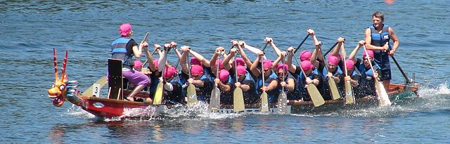

# Dragonboat - A Multi-Group Raft library in Go / [中文版](README.CHS.md) ##
[](https://github.com/lni/dragonboat/blob/master/LICENSE)

[](https://goreportcard.com/report/github.com/lni/dragonboat)
[](https://godoc.org/github.com/lni/dragonboat)
[](https://gitter.im/lni/dragonboat?utm_source=badge&utm_medium=badge&utm_campaign=pr-badge&utm_content=badge)

## v3.0 beta ##

This is a pre-release of dragonboat v3.0, it is provided for the community to review and test new features and changes. It should not be used in any production environment. Some of the major changes are - 

* disk based state machine with concurrent read/write access support has been added
* added the ability to request a snapshot to be captured
* added the ability to cleanup all data that belongs to a removed Raft node
* added the feature to repair a Raft cluster that have its majority nodes permanently lost
* added a new LogDB type that doesn't batch Raft entries, it has slightly lower throughput but uses less memory
* the Update() method of a state machine is now allowed to return a []byte as the update result
* the SaveSnapshot() method of a state machine is no longer required to return the number of bytes saved
* NewNodeHost() now returns an error when it fails to create a new NodeHost instance
* the drummer component has been moved into the internal package
* the C++ binding support has been moved out of the dragonboat repo for now, it is waiting be moved into its own repo
* many parts of the dragonboat library have been refactored

Please help to review the above changes and raise issues when you see anything broken or strange. 

## About ##
Dragonboat is a high performance multi-group [Raft](https://raft.github.io/) [consensus](https://en.wikipedia.org/wiki/Consensus_(computer_science)) library in [Go](https://golang.org/) with [C++11 binding](/binding) support.

Consensus algorithms such as Raft provides fault-tolerance by alllowing a system continue to operate as long as the majority member servers are available. For example, a Raft cluster of 5 servers can make progress even if 2 servers fail. It also appears to clients as a single node with strong data consistency always provided. All running servers can be used to initiate read requests for aggregated read throughput.

Dragonboat handles all technical difficulties associated with Raft to allow users to just focus on their application domains. It is also very easy to use, our step-by-step [examples](https://github.com/lni/dragonboat-example) can help new users to master it in half an hour.

## Features ##
* Easy to use API for building Raft based applications in Go or C++
* Feature complete and scalable multi-group Raft implementation
* Disk based and memory based state machine support
* Fully pipelined and TLS mutual authentication support, ready for high latency open environment
* Custom Raft log storage and Raft RPC support, easy to integrate with latest I/O techs
* [Extensively tested](/doc/test.md) including using [Jepsen](https://aphyr.com/tags/jepsen)'s [Knossos](https://github.com/jepsen-io/knossos) linearizability checker, some results are [here](https://github.com/lni/knossos-data)

Most features covered in Diego Ongaro's [Raft thesis](https://ramcloud.stanford.edu/~ongaro/thesis.pdf) have been supported -
* leader election, log replication, snapshotting and log compaction
* membership changes
* ReadIndex protocol for read-only queries
* leadership transfer
* non-voting members
* idempotent updates transparent to applications
* batching and pipelining
* disk based state machine

## Performance ##
Dragonboat is the __fastest__ open source multi-group Raft implementation on Github. 

For 3-nodes system using mid-range hardware, e.g. 22 cores Intel Xeon at 2.8Ghz and enterprise NVME SSD (details [here](doc/test.md)), Dragonboat can sustain at 9 million writes per second when the payload is 16bytes each or 11 million mixed I/O per second at 9:1 read:write ratio. High throughput is maintained in geographically distributed environment. When the RTT between nodes is 30ms, 2 million I/O per second can still be achieved using a much larger number of clients.


The number of concurrent active Raft groups affects the overall throughput as requests become harder to be batched. On the other hand, having thousands of idle Raft groups has a much smaller impact on throughput.


Table below shows write latencies in millisecond, Dragonboat has <5ms P99 write latency when handling 8 million writes per second at 16 bytes each. Read latency is lower than writes as the ReadIndex protocol employed for linearizable reads doesn't require fsync-ed disk I/O.

|Ops|Payload Size|99.9% percentile|99% percentile|AVG|
|:-:|:----------:|:--:|:-:|:-:|
|1m|16|2.24|1.19|0.79|
|1m|128|11.11|1.37|0.92|
|1m|1024|71.61|25.91|3.75|
|5m|16|4.64|1.95|1.16|
|5m|128|36.61|6.55|1.96|
|8m|16|12.01|4.65|2.13|

When tested on a single Raft group, Dragonboat can sustain writes at 1.25 million per second when payload is 16 bytes each, average latency is 1.3ms and the P99 latency is 2.6ms. This is achieved when using an average of 3 cores (2.8GHz) on each server.

As visualized below, Stop-the-World pauses caused by Go1.11's GC are sub-millisecond on highly loaded systems. Such very short Stop-the-World pause time is further significantly reduced in Go 1.12. Golang's runtime.ReadMemStats reports that less than 1% of the available CPU time is used by GC on highly loaded system.


## Requirements ##
* x86_64 Linux or MacOS, Go 1.11 or 1.12, GCC or Clang with C++11 support
* [RocksDB](https://github.com/facebook/rocksdb/blob/master/INSTALL.md) 5.13.4 or above when using RocksDB for storing Raft logs 

## Getting Started ##
__Note that, steps below use code from the Master branch. Master is our unstable branch for development. Please use released versions for any production purposes.__

To download Dragonboat to your [Go workspace](https://golang.org/doc/install):
```
$ go get -u -d github.com/lni/dragonboat
```
You need to decide whether to use [RocksDB or LevelDB](https://github.com/lni/dragonboat/blob/master/doc/storage.md) to store Raft logs. RocksDB is recommended.

### RocksDB ###
If RocksDB 5.13.4 or above has not been installed, use the following commands to install RocksDB 5.13.4 to /usr/local/lib and /usr/local/include.
```
$ cd $GOPATH/src/github.com/lni/dragonboat
$ make install-rocksdb-ull
```
Run built-in tests to check the installation:
```
$ cd $GOPATH/src/github.com/lni/dragonboat
$ make dragonboat-test
```
To build your application
```
CGO_CFLAGS="-I/path/to/rocksdb/include" CGO_LDFLAGS="-L/path/to/rocksdb/lib -lrocksdb" go build -v pkgname
```

### LevelDB ###
Nothing need to be installed when using LevelDB based Raft Log storage.

To run built-in tests using LevelDB based storage:
```
$ cd $GOPATH/src/github.com/lni/dragonboat
$ DRAGONBOAT_LOGDB=leveldb make dragonboat-test
```
To build the your application using LevelDB based Raft log storage
```
go build -v -tags="dragonboat_leveldb" pkgname
```

### Optional - C++ binding ###
The C++ binding is only required when you want to use Dragonboat in your C++ project. To install the C++ binding:
```
$ cd $GOPATH/src/github.com/lni/dragonboat
$ make binding
$ sudo make install-binding
```
Run C++ binding tests (gtest is required):
```
$ cd $GOPATH/src/github.com/lni/dragonboat
$ make clean
$ make test-cppwrapper
```

[FAQ](https://github.com/lni/dragonboat/wiki/FAQ), [docs](https://godoc.org/github.com/lni/dragonboat), step-by-step [examples](https://github.com/lni/dragonboat-example) and [online chat](https://gitter.im/lni/dragonboat) are available.

## Examples ##
Dragonboat examples are [here](https://github.com/lni/dragonboat-example).

## Status ##
Dragonboat is production ready.

## Contributing ##
For reporting bugs, please open an [issue](https://github.com/lni/dragonboat/issues/new). For contributing improvements or new features, please send in the pull request.

## License ##
Dragonboat is licensed under the Apache License Version 2.0. See LICENSE for details.

Third party code used in Dragonboat and their licenses is summarized [here](COPYRIGHT).
